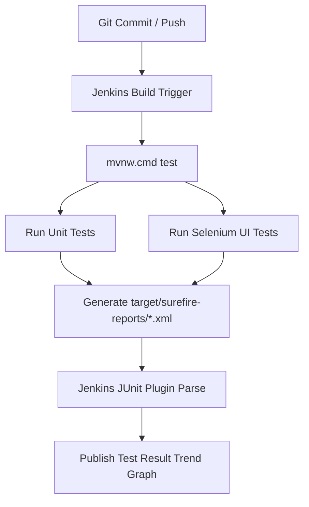

# Week 10: Continuous Testing in Jenkins

## 📋 Overview
In **Week 10**, we integrate **Continuous Testing** into our Jenkins CI/CD pipeline. With each commit or pull request, Jenkins automatically compiles the application, runs all **JUnit 5 Unit Tests** and **Selenium WebDriver UI Tests**, parses the Surefire XML test reports, and publishes visual test trend metrics in the Jenkins dashboard.

---

## 🏗️ Continuous Testing Workflow



---

## 📊 Surefire Test Report Integration

When Maven executes tests, it produces XML reports in `target/surefire-reports/`. In our `Jenkinsfile`, the `junit` step parses these XML files automatically:

```groovy
stage('Continuous Testing (Unit & Selenium UI)') {
    steps {
        bat 'mvnw.cmd test'
    }
    post {
        always {
            junit allowEmptyResults: true, testResults: 'target/surefire-reports/*.xml'
        }
    }
}
```

### Features Enabled by Continuous Testing:
1. **Automated Test Trend Graph**: Displays pass/fail/skip counts across historical builds.
2. **Quality Gates**: If any test fails, Jenkins marks the build as **FAILED** and prevents deployment.
3. **Failure Analysis**: Detailed stack traces and failure summaries are accessible directly in the Jenkins UI under **Test Result**.

---

## 🚀 Execution & Verification Guide

### 1. Trigger Continuous Testing in Jenkins
1. Open Jenkins Dashboard (`http://localhost:8085` or `http://localhost:8080`).
2. Go to your pipeline job `Workforce-Scheduling-Pipeline`.
3. Click **Build Now**.

### 2. View Test Results in Jenkins
1. Click on the latest build number (e.g. `#2`).
2. Click **Test Result** in the left menu.
3. Observe the breakdown:
   - `PortalSeleniumTest` (Selenium UI Tests)
   - Unit tests
4. Verify that all tests show status **PASSED**.
