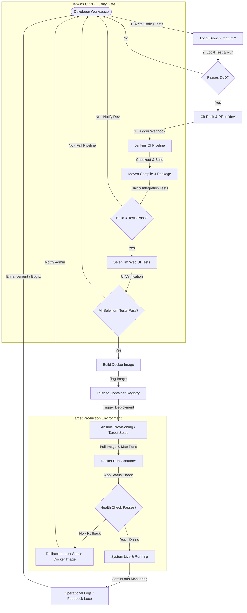

# Week 2: Agile Planning and DevOps Workflow

This document details the Agile Planning and DevOps Lifecycle design for the Automated Workforce Shift Scheduling System.

---

## 1. User Stories & Acceptance Criteria

### US-01: User Registration and Authentication
- **Description:** 
  - As a **System User (Employee or Manager)**,
  - I want to **register and authenticate myself using credentials**,
  - So that **I can securely access the shift scheduling workspace**.
- **Acceptance Criteria (Gherkin):**
  - *Scenario:* Successful Registration
    - **Given** I am a new user on the registration page,
    - **When** I fill in my Username, Email, Password, and select my Role ("Employee" or "Manager") and click "Register",
    - **Then** my account should be successfully created, and I should be redirected to the login page.
  - *Scenario:* Successful Login
    - **Given** I am a registered user on the login page,
    - **When** I enter my correct credentials and click "Login",
    - **Then** I should be redirected to my dashboard customized to my role.

### US-02: View Availability and Shift Slots
- **Description:** 
  - As an **Employee**,
  - I want to **view all open and assigned shift slots in a calendar/list view**,
  - So that **I can check schedule coverage and decide which shifts to request**.
- **Acceptance Criteria (Gherkin):**
  - *Scenario:* View Open Slots
    - **Given** I am logged in as an Employee,
    - **When** I navigate to the "Shift Board",
    - **Then** I should see a clear list/calendar of slots displaying shift date, time window, required role, and status (e.g., OPEN, PENDING, CONFIRMED).

### US-03: Submit Shift Booking Request
- **Description:** 
  - As an **Employee**,
  - I want to **book an available open shift slot**,
  - So that **I can claim the hours and confirm my work schedule**.
- **Acceptance Criteria (Gherkin):**
  - *Scenario:* Requesting an Open Slot
    - **Given** I am logged in and viewing an open slot on the "Shift Board",
    - **When** I click the "Request Book" button on an OPEN slot,
    - **Then** the slot status should change to PENDING, and a notification should be generated for the Manager.

### US-04: Booking Request Confirmation
- **Description:** 
  - As a **Manager**,
  - I want to **review and confirm/approve pending shift requests**,
  - So that **I can ensure optimal floor coverage and staff coordination**.
- **Acceptance Criteria (Gherkin):**
  - *Scenario:* Approving a Pending Slot
    - **Given** I am logged in as a Manager and view the "Requests Dashboard",
    - **When** I click "Approve" on an Employee's pending shift request,
    - **Then** the shift status should change to CONFIRMED, and the employee should be assigned to the slot.

### US-05: Shift Cancellation Request
- **Description:** 
  - As an **Employee**,
  - I want to **request a cancellation of a booked shift**,
  - So that **I can release my slot if I am unable to work due to personal emergencies**.
- **Acceptance Criteria (Gherkin):**
  - *Scenario:* Employee Cancels an Approved Shift
    - **Given** I am logged in and view my "My Shifts" tab,
    - **When** I click "Request Cancel" on a CONFIRMED shift,
    - **Then** the system should mark the shift as OPEN, remove my assignment, and notify the Manager.

### US-06: Status Tracking Dashboard
- **Description:** 
  - As an **Employee**,
  - I want to **track the real-time status of all my shift booking and cancellation requests**,
  - So that **I am informed about my updated work roster without manual follow-up**.
- **Acceptance Criteria (Gherkin):**
  - *Scenario:* Roster Tracking
    - **Given** I am logged in and navigate to "My Requests",
    - **When** I inspect the page,
    - **Then** I should see a historical list of my requests categorized by Status (PENDING, CONFIRMED, CANCELLED) with timestamps.

---

## 2. Product Backlog & Estimations
The product backlog is prioritized and estimated using Story Points (Fibonacci Sequence: 1, 2, 3, 5, 8).

| ID | Title | Priority | Story Points | Description |
| :--- | :--- | :---: | :---: | :--- |
| **PBI-01** | User Registration & Role-based Login | High | 5 | Setup user schema, secure authentication mechanism, and login page UI. |
| **PBI-02** | Shift Board & Slot View | High | 3 | Calendar/List UI to show available, pending, and booked slots. |
| **PBI-03** | Booking Request Workflow | High | 5 | Implement shift booking API, state transition to PENDING, database updates. |
| **PBI-04** | Manager Approval Panel | High | 3 | UI for Managers to view pending bookings, with single-click Approve/Reject APIs. |
| **PBI-05** | Cancellation Policy & Workflow | Medium | 3 | API to transition CONFIRMED slots back to OPEN and remove user mapping. |
| **PBI-06** | My Shifts & Request Tracker | Medium | 3 | Personalized employee dashboard for viewing status history and shifts. |

Total Estimated Story Points: **22 Story Points**

---

## 3. 15-Week Scrum Plan (Sprint Mapping)

We structure our 15-week plan into **5 Sprints** of 3 weeks each.

### 📅 Sprint 1: Foundation and Agile Planning (Weeks 1 - 3)
- **Goal:** Scope definition, Agile backlog setup, initial architecture design, local stack setup (Spring Boot, Maven, H2).
- **Deliverables:** Problem statement, Sprint Backlog, System Architecture Diagram, API specs, and skeleton application boot-up.

### 📅 Sprint 2: Core Development & Repository Setup (Weeks 4 - 6)
- **Goal:** Repo initialization, branch policies, implementing US-01 (Authentication), US-02 (Slot View), US-03 (Booking), US-04 (Approval), US-05 (Cancellation), and US-06 (Status Tracker).
- **Deliverables:** Complete functional MVP, Git branches, resolved conflicts, tagged MVP release (`v1.0.0-MVP`).

### 📅 Sprint 3: Continuous Integration & Automated Testing (Weeks 7 - 10)
- **Goal:** Integrate CI (Jenkins), build automation via Maven, Jenkinsfile deployment, Selenium UI testing, and test automation quality gates.
- **Deliverables:** Automated Jenkins build job, Jenkinsfile Pipeline-as-Code, local & Jenkins execution of Selenium UI test suites (Quality Gate).

### 📅 Sprint 4: Containerization & Continuous Deployment (Weeks 11 - 12)
- **Goal:** Containerize the application, configure Docker container lifecycles, and extend Jenkins pipeline to build, tag, and auto-deploy versioned Docker images.
- **Deliverables:** `Dockerfile`, versioned Docker images on local registry, automated Git-commit-to-running-Docker-container flow.

### 📅 Sprint 5: Infrastructure as Code & Final Release (Weeks 13 - 15)
- **Goal:** Setup configuration management (Ansible/Puppet), automate target environment provisioning, validate idempotency and recovery, compile project report, and run dry-run live demonstration.
- **Deliverables:** Ansible playbook, provisioned clean node, health check & rollback verification, project report, and video walkthrough.

---

## 4. Definition of Done (DoD)

To mark any user story or feature task as **Done**, it must pass the following criteria:
1. **Code Quality:** Written in accordance with clean coding standards (no compilation errors, zero critical SonarQube bugs).
2. **Local Testing:** Unit tests pass with minimum 80% coverage.
3. **Automated E2E Testing:** Happy-path E2E Selenium tests pass locally.
4. **CI Build Success:** The code compiles and builds successfully inside the Jenkins pipeline.
5. **Containerization Verification:** Docker image builds successfully and starts a healthy container without crash loops.
6. **Documentation:** Code comments updated, API specifications added to documentation, and weekly log entry finalized.
7. **Code Review:** Approved by at least one reviewer and successfully merged into the development branch.

---

## 5. DevOps Workflow Diagram

The sequence below illustrates the DevOps lifecycle for code changes made in the Automated Workforce Shift Scheduling System:

