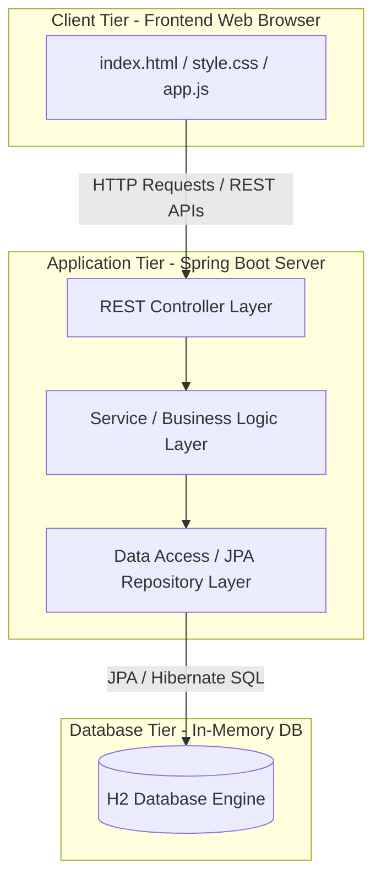
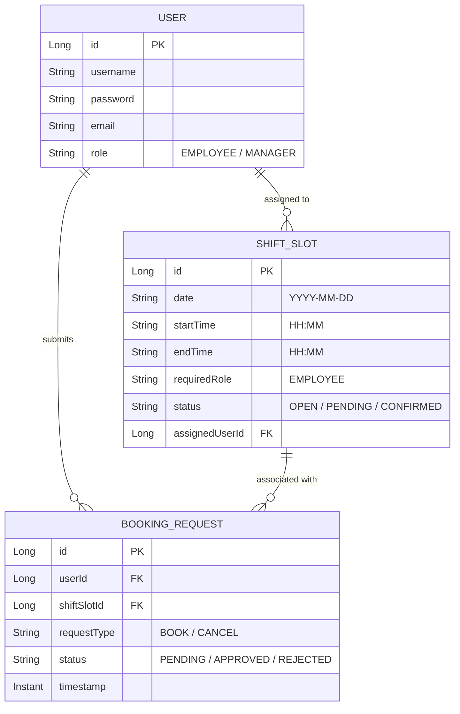

# Week 3: Requirements, Architecture, and Technology Setup

This document covers the Software Requirements Specification (SRS) summary, system architecture, database models, and API definitions for the Automated Workforce Shift Scheduling System.

---

## 1. SRS Summary

### 1.1 Functional Requirements (FR)
- **FR-01: Authentication:** Users (Employees/Managers) must register and log in securely.
- **FR-02: Shift Slot Board:** The system must render a schedule grid showing date, time, required role, and occupancy status.
- **FR-03: Booking Request:** Employees must be able to submit a request to book open shifts that match their role.
- **FR-04: Roster Approval:** Managers must see pending requests and approve/reject bookings to resolve coverage.
- **FR-05: Cancellation:** Employees can cancel their booked slots, changing the shift status back to OPEN.
- **FR-06: Request Tracking:** A dashboard tab must display the request history and real-time approval status.

### 1.2 Non-Functional Requirements (NFR)
- **NFR-01: Build and Package:** Automated package compilation using Maven with standard plugins.
- **NFR-02: Deployment Target:** Run standalone inside an embedded Tomcat web server, deployable inside Docker containers.
- **NFR-03: Responsiveness:** Web UI loads and responds to API queries in < 1 second on local networks.
- **NFR-04: Portability:** Database storage uses an in-memory database (H2) for portability across build boxes and production environments.

---

## 2. Use-Case Diagram
The following Mermaid diagram outlines the system interactions for the two core user roles:

```mermaid
leftToRightDirection
actor Employee
actor Manager

rectangle "Workforce Shift Scheduling System" {
    Employee --> (Register / Log in)
    Employee --> (View Open Shift Slots)
    Employee --> (Submit Booking Request)
    Employee --> (Request Shift Cancellation)
    Employee --> (Track Request Status)
    
    Manager --> (Register / Log in)
    Manager --> (View Dashboard & Coverage)
    Manager --> (Approve / Reject Requests)
    Manager --> (Add Open Shift Slots)
}
```

---

## 3. System Architecture Diagram
The architecture is structured as a standard 3-Tier Web Application:



---

## 4. Data Models (ER Schema)
The system represents data using three main database entities:



---

## 5. API Endpoint List

All backend APIs are structured as RESTful JSON endpoints.

| Method | Endpoint | Request Body | Response (Success 200/201) | Description |
| :--- | :--- | :--- | :--- | :--- |
| **POST** | `/api/auth/register` | `{ "username", "email", "password", "role" }` | `{ "id", "username", "email", "role" }` | Register a new account. |
| **POST** | `/api/auth/login` | `{ "username", "password" }` | `{ "id", "username", "role" }` | Authenticate and obtain user profile. |
| **GET** | `/api/shifts` | None | `[ { "id", "date", "startTime", "endTime", "status", "assignedUser" } ]` | Fetch all shift slots. |
| **POST** | `/api/shifts` | `{ "date", "startTime", "endTime" }` | `{ "id", "date", "status": "OPEN" }` | Add a new shift slot (Manager only). |
| **POST** | `/api/bookings/request` | `{ "userId", "shiftSlotId" }` | `{ "id", "status": "PENDING" }` | Create a pending booking request. |
| **POST** | `/api/bookings/{id}/approve` | None | `{ "id", "status": "APPROVED" }` | Approve booking, update slot to CONFIRMED. |
| **POST** | `/api/bookings/{id}/reject` | None | `{ "id", "status": "REJECTED" }` | Reject booking, revert slot to OPEN. |
| **POST** | `/api/bookings/{id}/cancel` | None | `{ "id", "status": "CANCELLED" }` | Cancel confirmed booking, open shift slot. |
| **GET** | `/api/users/{userId}/requests` | None | `[ { "id", "shiftSlot", "requestType", "status" } ]` | View user-specific request logs. |
