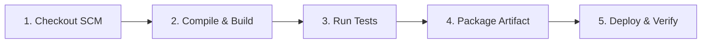

# Week 8: Pipeline as Code and Server Deployment

## 📋 Overview
In **Week 8**, we implement **Pipeline as Code** by defining a declarative `Jenkinsfile` in the root of our Git repository. This automates the entire Continuous Integration and Deployment pipeline: from code checkout, compilation, unit testing, artifact packaging, to deployment verification.

---

## 🏗️ Pipeline Stages & Workflow

### Stage Details:

1. **Checkout SCM**: Automatically pulls the latest commit from the Git repository branch.
2. **Compile & Build**: Executes `mvnw.cmd clean compile` to build all Spring Boot classes.
3. **Run Tests**: Executes `mvnw.cmd test` to run JUnit backend tests and publishes test XML reports via the `junit` plugin.
4. **Package Artifact**: Packages the Spring Boot application into an executable JAR (`target/scheduling-0.0.1-SNAPSHOT.jar`) and archives the JAR as a build artifact.
5. **Deploy & Verify**: Verifies that the build artifact exists and performs simulated server deployment validation.

---

## 🛠️ Step-by-Step Jenkins Configuration Guide

### 1. Create a New Pipeline Job in Jenkins
1. Open Jenkins Dashboard (`http://localhost:8085` or `http://localhost:8080`).
2. Click **New Item**.
3. Enter item name: `Workforce-Scheduling-Pipeline`.
4. Select **Pipeline** and click **OK**.

### 2. Configure Pipeline Definition
1. Scroll down to the **Pipeline** section.
2. Set **Definition**: `Pipeline script from SCM`.
3. Set **SCM**: `Git`.
4. **Repository URL**: Provide local Git path or GitHub repository URL.
   - Example: `d:/Sem7/Devops_proj/WorkForce_Scheduling_Final/worforce_scheduling` or your GitHub URL `https://github.com/.../worforce_scheduling.git`.
5. **Script Path**: Ensure it is set to `Jenkinsfile`.
6. Click **Save**.

### 3. Run the Pipeline
1. Click **Build Now** in the left sidebar.
2. Click on the active build number (e.g. `#1`) -> **Console Output** to monitor progress across all 5 stages.

---

## 📊 Expected Output & Verification
- **Test Reports**: Jenkins will render test result trends under `Test Result`.
- **Artifacts**: The packaged executable JAR `scheduling-0.0.1-SNAPSHOT.jar` will be downloadable directly from the Jenkins build page.
