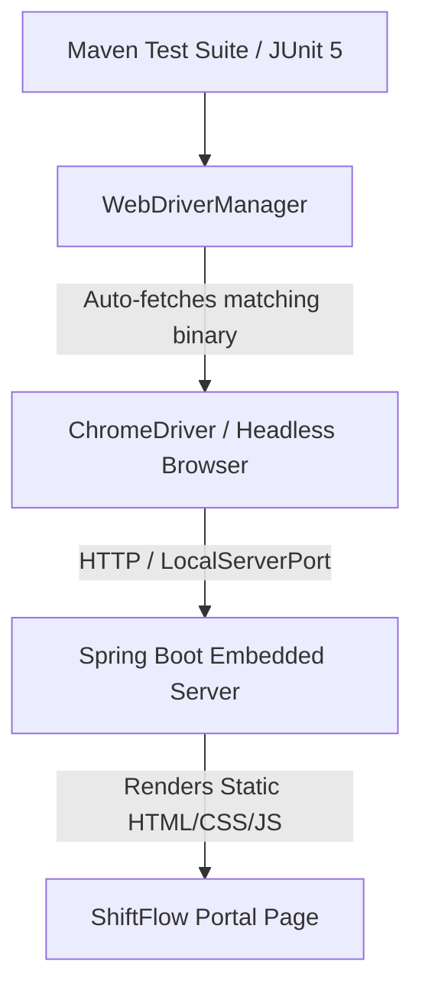

# Week 9: Selenium Test Design and Local Execution

## 📋 Overview
In **Week 9**, we design and execute automated UI tests using **Selenium WebDriver** and **WebDriverManager** integrated into our Spring Boot JUnit test suite. This enables continuous end-to-end testing of user interaction flows, page accessibility, and dynamic tab navigation.

---

## 🏗️ Selenium Test Architecture



---

## 🧪 Test Suite Details (`PortalSeleniumTest.java`)

| Test Method | Category | Objective | Verification Criterion |
| :--- | :--- | :--- | :--- |
| `testHomePageTitleAndBrand()` | UI Verification | Validates page header and brand logo rendering | Page title contains `"Workforce Scheduling System"` and `.brand h2` equals `"ShiftFlow"` |
| `testNavigationTabs()` | Interactive Navigation | Tests tab navigation from Dashboard to Shift Board | `#current-section-title` text updates to `"Available Roster Slots"` |
| `testLoginModalVisibility()` | Modal & Auth Flow | Tests opening the Sign In / Register popup modal | `#auth-modal` CSS `display` changes from `none` to `flex`/visible |

---

## ⚙️ Driver & Environment Configuration

The test suite leverages `ChromeOptions` in **headless mode** (`--headless=new`) to support headless execution on CI servers (like Jenkins) as well as local machines without requiring an active desktop display.

```java
ChromeOptions options = new ChromeOptions();
options.addArguments("--headless=new");
options.addArguments("--no-sandbox");
options.addArguments("--disable-dev-shm-usage");
```

---

## 🚀 Execution Instructions

To execute the Selenium test suite locally:

```powershell
.\mvnw.cmd test -Dtest=PortalSeleniumTest
```

Or to run all unit and UI integration tests:
```powershell
.\mvnw.cmd test
```

### Expected Output:
```text
[INFO] Running com.workforce.scheduling.selenium.PortalSeleniumTest
[INFO] Tests run: 3, Failures: 0, Errors: 0, Skipped: 0, Time elapsed: ... s - in com.workforce.scheduling.selenium.PortalSeleniumTest
[INFO] BUILD SUCCESS
```
